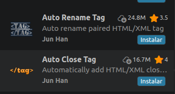

# PROYECTO_GESTION_VEHICULOS
Proyecto de una aplicacion que sirve para gestionar vehículos junto a su conductor su ruta sus sensores y su mercancia

## Qué es Git Flow

*Git flow es un modelo de ramificación para Git que ofrece un enfoque estructurado para el desarrollo de software. Define ramas específicas para diferentes propósitos y describe cómo deben interactuar. El objetivo es agilizar el proceso de desarrollo, gestionar los lanzamientos (releases) de manera eficaz y facilitar la colaboración entre los miembros del equipo.*

## Diagrama de FLujo de Este Repositorio para la realizacion del proyecto.

## Ventajas de usar Git Flow

- **Separación clara de entornos**: la rama `main` contiene siempre código estable en producción, mientras que `develop` centraliza el desarrollo activo.
- **Desarrollo paralelo**: mediante ramas `feature`, varios miembros del equipo pueden trabajar simultáneamente sin interferencias.
- **Gestión controlada de versiones**: las ramas `release` permiten preparar versiones antes de su despliegue, asegurando calidad mediante pruebas.
- **Corrección rápida de errores críticos**: gracias a las ramas `hotfix`, se pueden solucionar fallos en producción de forma inmediata sin afectar al desarrollo en curso.
- **Mejora continua del código**: el uso de ramas específicas como `refactor` facilita la optimización del sistema sin introducir nuevas funcionalidades.

En un contexto donde la fiabilidad es clave (por ejemplo, garantizar que la mercancía se transporta en condiciones óptimas), este modelo ayuda a reducir errores, mejorar la trazabilidad de cambios y asegurar la estabilidad del sistema en todo momento.

## Extensiones que recomendamos usar en VS CODE

- *HTML*

*Estas extensiones para HTML y CSS las recomendamos porque nos va a facilitar mucho a la hora de declarar las variables como div se abren y se cierran solas.*
*Bootstrap la recomendamos porque nos permite declarar toda la estructura HTML y ademas permite hacer cosas como modales e importar iconos para nuestra web.*