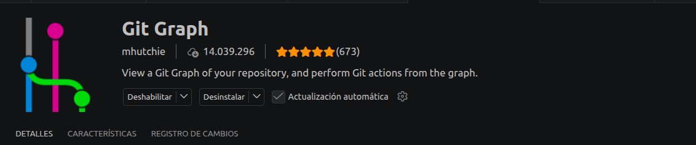
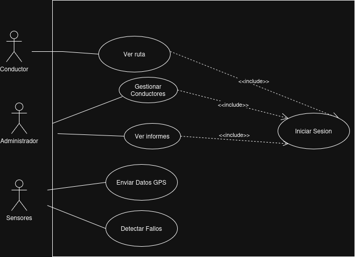
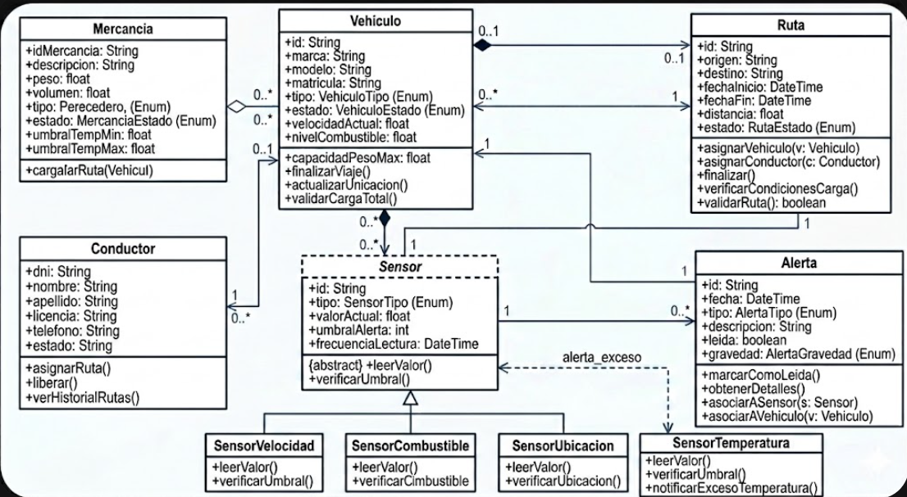
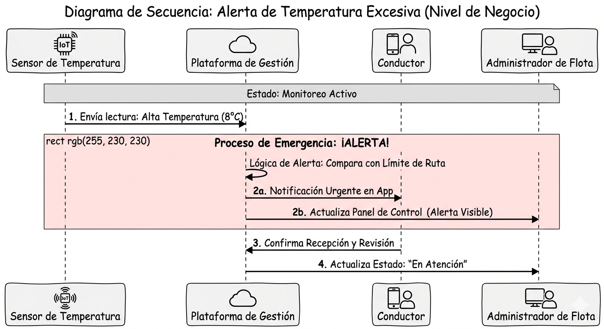

# PROYECTO_GESTION_VEHICULOS
Proyecto de una aplicacion que sirve para gestionar vehículos junto a su conductor su ruta sus sensores y su mercancia

## Qué es Git Flow

*Git flow es un modelo de ramificación para Git que ofrece un enfoque estructurado para el desarrollo de software. Define ramas específicas para diferentes propósitos y describe cómo deben interactuar. El objetivo es agilizar el proceso de desarrollo, gestionar los lanzamientos (releases) de manera eficaz y facilitar la colaboración entre los miembros del equipo.*

## Diagrama de FLujo de Este Repositorio para la realizacion del proyecto.

## Ventajas de usar Git Flow

- **Separación clara de entornos**: la rama `main` contiene siempre código estable en producción, mientras que `develop` centraliza el desarrollo activo.
- **Desarrollo paralelo**: mediante ramas `feature`, varios miembros del equipo pueden trabajar simultáneamente sin interferencias.
- **Gestión controlada de versiones**: las ramas `release` permiten preparar versiones antes de su despliegue, asegurando calidad mediante pruebas.
- **Corrección rápida de errores críticos**: gracias a las ramas `hotfix`, se pueden solucionar fallos en producción de forma inmediata sin afectar al desarrollo en curso.
- **Mejora continua del código**: el uso de ramas específicas como `refactor` facilita la optimización del sistema sin introducir nuevas funcionalidades.

En un contexto donde la fiabilidad es clave (por ejemplo, garantizar que la mercancía se transporta en condiciones óptimas), este modelo ayuda a reducir errores, mejorar la trazabilidad de cambios y asegurar la estabilidad del sistema en todo momento.

## Extensiones que recomendamos usar en VS CODE

- **HTML**

*Estas extensiones para HTML y CSS las recomendamos porque nos va a facilitar mucho a la hora de declarar las variables como div se abren y se cierran solas.*

*Bootstrap la recomendamos porque nos permite declarar toda la estructura HTML y ademas permite hacer cosas como modales e importar iconos para nuestra web.*

- **GIT**

*Esta extension la recomendamos en relación a ver el grafico de flujo que va tomando nuetro proyecto en cuanto a ramas y si hay muchas burficificaciones o si hay algo que no cuadra en cuanto a combinar las ramas , nos sirve mucho para ver como avanza el proyecto.*

- **JAVA**

*Esto es lo necesario para empezar en Java y funciona junto al jdk de Java y contiene las siguientes cosas:*

 **🔹 1. Language Support for Java™ by Red Hat**

- *Autocompletado inteligente*
- *Navegación por el código*
- *Detección de errores*
- *Usa el servidor de lenguaje de Red Hat*

**🔹 2. Debugger for Java**

- *Permite ejecutar código paso a paso*
- *Breakpoints (puntos de parada)*
- *Inspección de variables*

**🔹 3. Test Runner for Java**

- *Ejecutar tests (JUnit)*
- *Ver resultados de pruebas*
- *Integración con testing*

**🔹 4. Maven for Java**

- *Gestión de dependencias*
- *Compilación del proyecto*
- *Soporte para proyectos Maven*

**🔹 5. Project Manager for Java**

- *Organiza proyectos Java*
- *Vista estructurada del proyecto*
- *Gestión de múltiples proyectos*

## Diagrama de Casos de Uso

**1. Trazabilidad de la Responsabilidad (Accountability)**

En un entorno de mercancías críticas, la **responsabilidad verificable** es el activo intangible más valioso.

* **Justificación:** La inclusión obligatoria del caso de uso `Iniciar Sesión` en las acciones del **Conductor** y el **Administrador** garantiza que cada interacción quede vinculada a una identidad única.

* **Valor:** Esto proporciona seguridad jurídica y transparencia, permitiendo reconstruir la cadena de custodia ante cualquier incidencia o auditoría externa.

 **2. Conciencia Situacional y Resiliencia**

El sistema transita de una logística reactiva a una **logística predictiva** mediante la integración del actor **Sensores**.
* **Justificación:** Los casos de uso `Enviar Datos GPS` y `Detectar Fallos` operan de forma autónoma a la intervención humana.

* **Valor:** Este flujo constante genera el intangible de **paz mental operativa**. La plataforma permite anticiparse a la pérdida de cadena de frío o desviaciones de ruta, protegiendo la reputación de la empresa y la integridad del producto antes de que el daño sea irreversible.

**3. Armonización de la Inteligencia Operativa**

El diseño justifica la convergencia de tres perspectivas distintas en una sola fuente de verdad:

1. **El Administrador:** Supervisión estratégica y gestión de talento.
2. **El Conductor:** Ejecución táctica y navegación.
3. **El Sistema de Sensores:** Verdad técnica objetiva (Temperatura, GPS, Estado).

## Diagrama de Clases

**1. Especialización mediante Herencia (Patrón de Monitoreo)**

El diagrama emplea una clase abstracta `Sensor` de la cual derivan sensores específicos: `SensorTemperatura`, `SensorVelocidad`, `SensorUbicacion` y `SensorCombustible`.

* **Justificación:** Esta estructura permite tratar a todos los sensores de forma genérica para funciones comunes, pero otorga comportamientos únicos (como `notificarExcesoTemperatura`) a los sensores especializados.

* **Valor Intangible:** **Escalabilidad y Adaptabilidad.** El sistema es capaz de evolucionar ante nuevas normativas de transporte (por ejemplo, añadir sensores de humedad) sin necesidad de reescribir el núcleo del software.

**2. Garantía de la Cadena de Custodia y Calidad**

La clase `Mercancia` posee atributos críticos de control, como `umbralTempMin` y `umbralTempMax`.

* **Justificación:** Estos atributos alimentan la lógica del `SensorTemperatura`. Cuando el método `verificarUmbral()` detecta una desviación, se dispara automáticamente la creación de una entidad `Alerta`.

* **Valor Intangible:** **Mitigación Automática de Daños.** La plataforma garantiza la integridad del producto de forma proactiva, eliminando la dependencia del factor humano para detectar fallos en la cadena de frío o de seguridad.

**3. Integridad y Cohesión de Activos**

El modelo vincula las clases `Vehiculo`, `Conductor` y `Ruta` con multiplicidades estrictas.

* **Justificación:** La relación de **Agregación** entre `Vehiculo` y `Mercancia`, junto con la vinculación al `Conductor`, asegura que el sistema siempre conozca el estado de la carga y el responsable legal de la misma en tiempo real.

* **Valor Intangible:** **Trazabilidad Total (Accountability).** En logística crítica, la capacidad de reconstruir los eventos de una ruta es un activo legal y operativo que genera confianza ante clientes y entes reguladores.

**4. Robustez de Datos mediante Tipos Enumerados (Enums)**

Se utilizan tipos enumerados para `VehiculoEstado`, `MercanciaEstado`, `RutaEstado` y `AlertaGravedad`.

* **Justificación:** El uso de `Enums` restringe los valores posibles a estados lógicos de negocio, evitando que el sistema entre en estados inconsistentes o errores de entrada de datos.

* **Valor Intangible:** **Consistencia de la Información.** Garantiza que los informes de gestión sean precisos, facilitando la toma de decisiones basada en datos reales y normalizados.

## Diagrama de Secuencias

*El diagrama de secuencia presentado modela la interacción dinámica y temporal ante un evento crítico. Este diseño justifica la capacidad de respuesta inmediata del sistema frente a anomalías en la mercancía.*

**1. Automatización de la Respuesta Crítica**

El flujo comienza con una lectura automática del **Sensor de Temperatura** hacia la **Plataforma de Gestión**. 
* **Justificación:** Se demuestra que la detección de fallos no requiere intervención humana inicial, eliminando tiempos muertos. 

* **Valor Intangible:** **Seguridad Proactiva.** El sistema actúa como un vigilante incansable que garantiza la integridad de la carga 24/7. 

**2. Lógica de Decisión Centralizada**

La plataforma ejecuta un proceso de "Lógica de Alerta" comparando los datos recibidos con los límites de la ruta. 

* **Justificación:** Este paso justifica la inteligencia del software para discernir entre variaciones normales y emergencias reales. 

* **Valor Intangible:** **Precisión Operativa.** Reduce el ruido de falsas alarmas, permitiendo que el personal se enfoque solo en riesgos confirmados. 

**3. Sincronización Multi-Actor en Tiempo Real**

El diagrama muestra una difusión paralela (2a y 2b) hacia el **Conductor** y el **Administrador de Flota**. 

* **Justificación:** Garantiza que todos los responsables tengan la misma información de forma simultánea (Single Source of Truth). 

* **Valor Intangible:** **Conciencia Situacional Colectiva.** Mejora la coordinación del equipo, permitiendo que el conductor actúe en campo mientras el administrador gestiona la logística de respaldo. 

**4. Trazabilidad del Cierre de Incidencias**

El flujo concluye con la "Confirmación de Recepción" y la actualización del estado a "En Atención".

* **Justificación:** Este cierre de ciclo es vital para asegurar que ninguna alerta quede ignorada o en el olvido. 

* **Valor Intangible:** **Garantía de Responsabilidad (Accountability).** Proporciona una auditoría clara sobre quién atendió la emergencia y en qué momento exacto se tomó el control.
